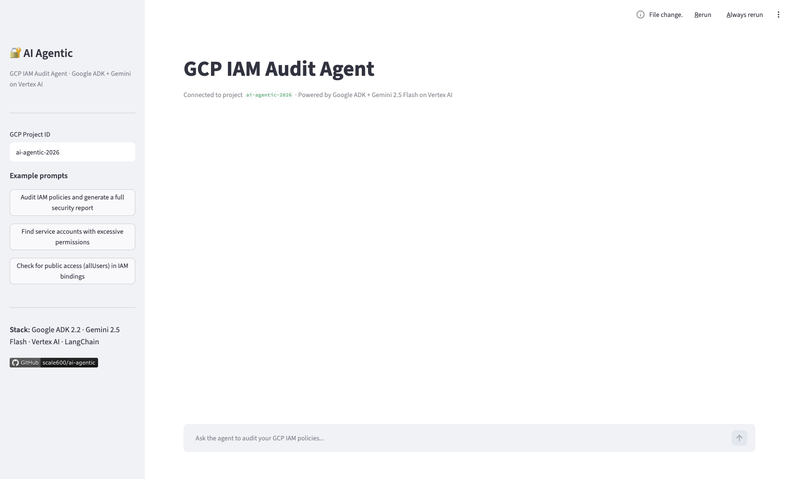
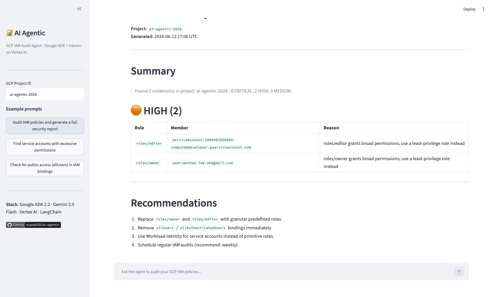

# ai-agentic — GCP IAM Audit Agent

> Automated GCP IAM Audit powered by **Google ADK 2.2 + Gemini 2.5 Flash on Vertex AI**

[](https://github.com/scale600/ai-agentic/actions/workflows/deploy.yml)

**Live Demo:** [ai-agentic.techcloudup.com](https://ai-agentic.techcloudup.com)

---

## What it does

Type a natural language request → the Agent calls real GCP APIs → generates an IAM audit report.

```
"Audit IAM policies for project my-project-123.
 Find service accounts with excessive permissions."

        ↓  ReAct: Think → Act → Observe → Think

→ get_iam_policy(project_id)       # Cloud Resource Manager API
→ list_service_accounts(project)   # IAM API
→ analyze_permissions(policy)      # detect overprivileged accounts
→ generate_audit_report()          # Markdown report

        ↓

Rendered in Streamlit Chat UI with real-time reasoning trace
```

---

## Architecture

```
┌─────────────────────────────────────────────────────┐
│                  Streamlit Chat UI                   │
│              (app/main.py · port 8080)               │
└──────────────────────┬──────────────────────────────┘
                       │
┌──────────────────────▼──────────────────────────────┐
│              Supervisor LlmAgent                     │
│         (Google ADK 2.2 · ReAct pattern)            │
│                  Gemini 2.5 Flash                    │
│              via Vertex AI (us-central1)             │
└───────────┬─────────────────────────────────────────┘
            │  sub_agents
┌───────────▼─────────────┐
│    IAM Audit Agent       │
│  ┌───────────────────┐  │
│  │ get_iam_policy()  │  │  ←── Cloud Resource Manager API
│  │ list_svc_accts()  │  │  ←── IAM API
│  │ analyze_perms()   │  │
│  │ generate_report() │  │
│  └───────────────────┘  │
└─────────────────────────┘

Infrastructure: Cloud Run · Artifact Registry · Terraform · GitHub Actions WIF
```

---

## Screenshots

### Chat UI with Reasoning Trace



### Audit Report Output



---

## Quickstart

### Prerequisites

- Python 3.11+
- GCP project with Vertex AI enabled
- `gcloud` CLI authenticated

### Local Development

```bash
# Clone
git clone https://github.com/scale600/ai-agentic.git
cd ai-agentic

# Python env
python -m venv .venv && source .venv/bin/activate
pip install -r requirements.txt

# GCP auth (no SA key files needed)
gcloud auth application-default login

# Configure
cp .env.example .env
# Edit .env: set GCP_PROJECT_ID, GOOGLE_CLOUD_PROJECT

# Run
streamlit run app/main.py
```

Open [http://localhost:8501](http://localhost:8501) and try:

> "Audit IAM policies for project `<your-project-id>`. Find overprivileged service accounts."

---

## Tech Stack

| Layer | Technology |
|-------|-----------|
| AI Framework | [Google ADK](https://google.github.io/adk-docs/) 2.2.0 |
| LLM | Gemini 2.5 Flash via Vertex AI |
| UI | Streamlit 1.35+ |
| Deployment | Cloud Run (serverless) |
| IaC | Terraform (hashicorp/google ~> 6.0) |
| CI/CD | GitHub Actions + Workload Identity Federation |
| Auth | ADC locally · Attached SA on Cloud Run · WIF on GitHub Actions |

---

## Project Structure

```
ai-agentic/
├── app/
│   ├── main.py               # Streamlit Chat UI
│   └── agent_client.py       # ADK Runner wrapper
├── agents/
│   ├── supervisor.py         # Supervisor LlmAgent + sub_agents
│   └── iam_audit_agent.py    # IAM Audit sub-agent
├── tools/
│   ├── gcp_iam_tools.py      # get_iam_policy, list_service_accounts, analyze_permissions
│   └── report_tools.py       # generate_audit_report (Markdown)
├── config/
│   └── settings.py           # python-dotenv env loader
├── terraform/
│   ├── main.tf               # Artifact Registry, SA, IAM, Cloud Run v2
│   ├── variables.tf
│   └── outputs.tf
├── .github/workflows/
│   └── deploy.yml            # Auto-deploy on main push (WIF, no SA keys)
├── Dockerfile                # python:3.11-slim, linux/amd64
└── requirements.txt
```

---

## Deployment

### Terraform (first-time infra setup)

```bash
cd terraform
terraform init
terraform apply -var="project_id=your-project-id"
```

### CI/CD (subsequent deploys)

Push to `main` → GitHub Actions automatically:
1. Authenticates via Workload Identity Federation (no SA key files)
2. Builds `linux/amd64` image and pushes to Artifact Registry
3. Deploys to Cloud Run

### Manual deploy

```bash
# Build and push
docker buildx build --platform linux/amd64 \
  -t us-central1-docker.pkg.dev/ai-agentic-2026/ai-agentic/app:latest \
  --push .

# Deploy
gcloud run deploy ai-agentic \
  --image=us-central1-docker.pkg.dev/ai-agentic-2026/ai-agentic/app:latest \
  --region=us-central1
```

---

## Security

```
❌ Prohibited: SA key JSON files in code or env vars
✅ Local:      gcloud auth application-default login
✅ Cloud Run:  Attached service account (Workload Identity)
✅ CI/CD:      Workload Identity Federation (OIDC, keyless)
```

---

## Topics

`agentic-ai` · `vertex-ai` · `google-adk` · `gemini` · `gcp` · `cloud-run` · `python` · `streamlit`
